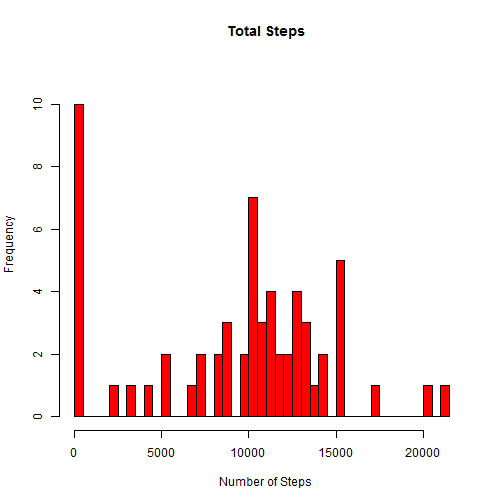
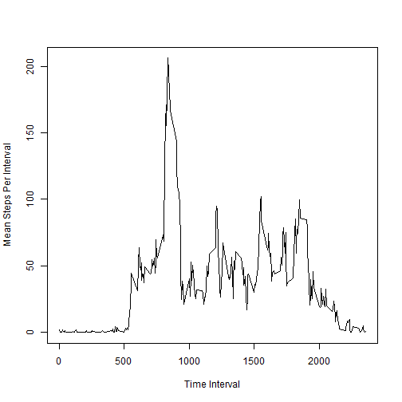
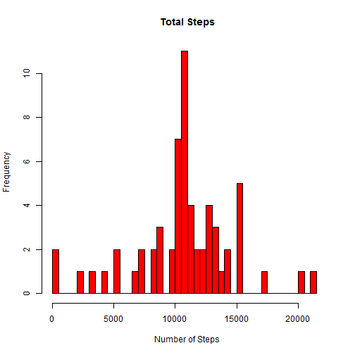
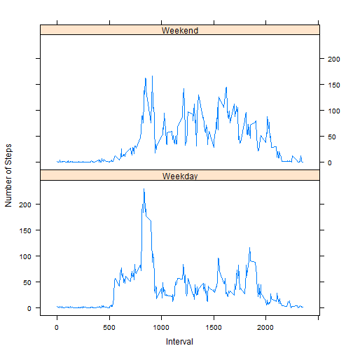

Reproducible Research: Peer Assessment 1
========================


This is the markdown file for Peer Assessment 1 of the Reproducible Research Course

## Loading and preprocessing data.


```r
data<-read.csv("activity.csv")
data$date<-as.Date(data$date)
```

## Total number of steps per day.


```r
Steps<-aggregate(data$steps,by=list(data$date),FUN=sum,na.rm=TRUE)
colnames(Steps)<-c("date","steps")
```

## Histogram of total number of steps taken per day


```r
Un<-length(unique(Steps$steps))
hist(Steps$steps,breaks=Un,main="Total Steps",xlab="Number of Steps",ylab="Frequency",col="Red",xlim=range(0,22000),ylim=range(0,11))
```

 

## Mean and median of total steps per day:


```r
print(paste("Mean=",mean(Steps$steps)))
```

```
## [1] "Mean= 9354.22950819672"
```

```r
print(paste("Median=",median(Steps$steps)))
```

```
## [1] "Median= 10395"
```

## Time series plot
Plot of 5-minute interval (x-axis) and the average number of steps taken, averaged across all days (y-axis)


```r
Interval<-aggregate(data$steps,by=list(data$interval),FUN=mean,na.rm=TRUE)
  colnames(Interval)<-c("Interval","MeanSteps")
  plot(Interval$Interval,Interval$MeanSteps,type="l",xlab="Time Interval",ylab="Mean Steps Per Interval")
```

 

## Which 5-minute interval, on average across all the days in the dataset, contains the maximum number of steps?


```r
Max<-max(Interval$MeanSteps,na.rm=TRUE)
IntMax<-Interval$Interval[Interval$MeanSteps==Max]
print(IntMax)
```

```
## [1] 835
```

## Calculate and report the total number of missing values in the dataset (i.e. the total number of rows with NAs)


```r
length(data[is.na(data$steps),1])
```

```
## [1] 2304
```

## Fill in all of the missing values in the dataset with mean for that 5 minute interval.


```r
index<-which(is.na(data))
  for (i in 1:length(index)){
  data[index,"steps"][i]<- Interval[Interval$Interval==data[index,"interval"][i],"MeanSteps"]
  }
```

## New dataset 
This is equal to the original dataset but with the missing data filled in.


```r
dataClean<-data #New dataset
rm(data)
```

## Histogram of the total number of steps taken each day. 
Missing values filled in


```r
Steps2<-aggregate(dataClean$steps,by=list(dataClean$date),FUN=sum,na.rm=TRUE)
  colnames(Steps2)<-c("date","steps")
  hist(Steps2$steps,breaks=Un,main="Total Steps",xlab="Number of Steps",ylab="Frequency",col="Red",xlim=range(0,22000),ylim=range(0,11))
```

 

## Calculate and report the mean and median total number of steps taken per day. 

### Do these values differ from the estimates from the first part of the assignment? 
Yes, both are higher.

### What is the impact of inputting missing data on the estimates of the total daily number of steps?
Inserting 5min average into missing data slots will allow more accurate conclusions to be drawn


```r
print(paste("Mean=",mean(Steps2$steps)))
```

```
## [1] "Mean= 10766.1886792453"
```

```r
print(paste("Median=",median(Steps2$steps)))
```

```
## [1] "Median= 10766.1886792453"
```


## New factor variable 
This has two levels - "weekday" and "weekend" and indicates whether a given date is a weekday or weekend day.


```r
dataClean$date<-weekdays(dataClean$date)
dataClean$date[dataClean$date=="Saturday"]<-"Weekend"
dataClean$date[dataClean$date=="Sunday"]<-"Weekend"
dataClean$date[dataClean$date!="Weekend"]<-"Weekday"
dataClean$date<-as.factor(dataClean$date)
levels(dataClean$date)<-c("Weekday","Weekend")
```

## Panel plot 
This contains a series plot (i.e. type = "l") of the 5-minute interval (x-axis) and the average number of steps taken, averaged across all weekday days or weekend days (y-axis).


```r
  library(lattice)
  Interval<-aggregate(dataClean$steps,by=list(dataClean$interval,dataClean$date),FUN=mean,na.rm=TRUE)
  colnames(Interval)<-c("Interval","DayType","MeanSteps")  
  xyplot(MeanSteps~Interval|DayType,data=Interval,layout=c(1,2),xlab="Interval",ylab="Number of Steps",type="l")
```

 

